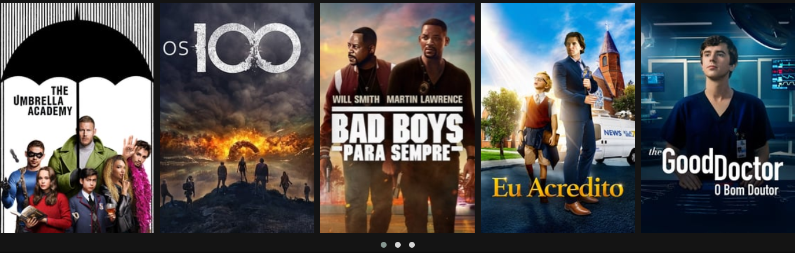

# Demo



## Menu
* [Tecnologias](#Tecnologias)
* [Como Utilizar](#Como-Utilizar)
* [About](#About)
* [Link do Curso](#Link-do-Curso)
* [License](#License)

## Tecnologias
Projeto desenvolvido com as seguintes tecnologias:
* HTML5
* CSS3
* jQuery

## Como Utilizar
```
1. - Clone o repositório
$ git clone https://github.com/ale-mouraboni/netflix-interface.git

2. - Abra o index.html
```

## About
Esse é um projeto bem simples de um clone de uma interface da Netflix, desenvolvido com HTML, CSS e jQuery básico.  
Esse projeto foi desenvolvido durante o bootcamp **HTML Web Developer** na plataforma **Digital Innovation One**.

### Link do Curso:

* [Digital Innovation One - HTML Web Developer](https://digitalinnovation.one/)

## License
This project is under the MIT license. See the [LICENSE] for more information.

