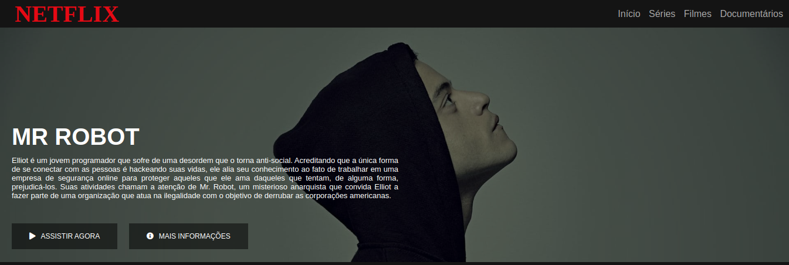

<h1 align="center">Netflix Interface</h1>
<p align="center">
  
  
  

</p>

<p align="center">
  Esse projeto foi desenvolvido durante o bootcamp <strong>HTML Web Developer</strong> na plataforma <a href="https://digitalinnovation.one/">Digital Innovation One</a>.
</p>

<p align="center">
   <a href="#globe_with_meridians-Tecnologias">Tecnologias</a>
  &nbsp;&nbsp;&nbsp;|&nbsp;&nbsp;&nbsp;
  <a href="#wrench-Como-Utilizar">Como Utilizar</a>
  &nbsp;&nbsp;&nbsp;|&nbsp;&nbsp;&nbsp;
  <a href="#heavy_check_mark-About">About</a>
  &nbsp;&nbsp;&nbsp;|&nbsp;&nbsp;&nbsp;
  <a href="#memo-License">License</a> 
</p>
</p>

## :globe_with_meridians: Tecnologias
<p>Projeto desenvolvido com as seguintes tecnologias:</p>

* HTML5
* CSS3
* jQuery

## :wrench: Como Utilizar

```
#1 - Clone o repositório
$ git clone https://github.com/ale-mouraboni/netflix-interface.git

#2 - Abra o index.html
```

## :heavy_check_mark: About
<p>Esse é um projeto bem simples de um clone de uma interface da Netflix, desenvolvido com HTML, CSS e jQuery básico.
</br>
Esse projeto foi desenvolvido durante o bootcamp <strong>HTML Web Developer</strong> na plataforma <strong>Digital Innovation One</strong>.
</p>

### Responsive?
[x] Yes  [ ] No

## :memo: License
<p>This project is under the MIT license. See the [LICENSE] for more information.
</p>
